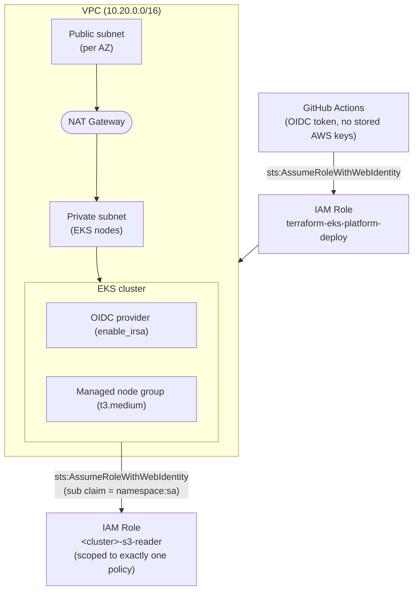

# terraform-eks-platform

A minimal, production-shaped AWS landing zone: VPC, EKS, and IAM Roles for
Service Accounts (IRSA), deployed exclusively through GitHub Actions using
OIDC federation - no long-lived AWS access keys stored anywhere.

> **Cost warning:** the EKS control plane is billed at $0.10/hour
> (~$72/month) the moment `apply` finishes, on top of EC2 node cost. It is
> **not** covered by the AWS free tier. This repo is built to be applied,
> demoed, and destroyed the same day via the `Terraform Destroy` workflow -
> see [docs/bootstrap.md](docs/bootstrap.md).

## Why this exists

Most "Terraform + AWS" portfolio repos stop at `terraform apply` from a
laptop with a hardcoded `AWS_ACCESS_KEY_ID`. This one is built the way I'd
actually want to find infrastructure at a new job:

- **State lives in S3 + DynamoDB**, not on anyone's laptop, with locking so
  two applies can't race each other.
- **No static AWS credentials, anywhere.** CI assumes an IAM role via GitHub's
  OIDC provider, scoped by trust policy to this one repo. Credentials are
  minted per workflow run and expire on their own.
- **Plan runs on every PR** and gets posted as a comment before anything is
  allowed to merge. Apply and destroy are gated behind a GitHub Environment
  with required manual approval - `git push` alone can't touch AWS.
- **IRSA is hand-rolled, not hidden behind a module.** `modules/irsa-role`
  spells out the actual OIDC trust condition (`sub` claim matching
  `system:serviceaccount:<namespace>:<name>`) because that's the mechanism
  worth understanding, not just invoking.

## Architecture



## Repo structure

```
.
├── main.tf                    # VPC + EKS + demo IRSA role wiring
├── variables.tf
├── outputs.tf
├── providers.tf
├── versions.tf                 # provider + S3 backend config
├── modules/
│   └── irsa-role/               # hand-written IRSA trust policy module
├── .github/workflows/
│   ├── terraform-plan.yml       # PR: fmt, validate, plan, comment
│   ├── terraform-apply.yml      # push to main: apply (manual approval gate)
│   └── terraform-destroy.yml    # manual-only teardown
└── docs/
    └── bootstrap.md             # one-time setup: state backend, OIDC, IAM role
```

## Quickstart

Full walkthrough in [docs/bootstrap.md](docs/bootstrap.md). Short version:

1. Create the S3 state bucket + DynamoDB lock table (one-time, manual).
2. Register GitHub's OIDC provider in IAM and create the deploy role,
   trust-scoped to this repo (one-time, manual).
3. Add the role ARN as a repo variable (`AWS_ROLE_ARN`).
4. Add a `production` GitHub Environment with required reviewers.
5. Open a PR - `terraform-plan.yml` comments the plan. Merge - `terraform-apply.yml`
   runs and waits for your approval.
6. When you're done: Actions -> **Terraform Destroy** -> type `destroy` -> approve.

## What's deliberately simplified

This is a portfolio/demo repo, not a multi-account org:

- Single AWS account, single environment (`dev`).
- One NAT Gateway instead of one per AZ (saves ~$32/month; real prod HA
  wants per-AZ NAT).
- Deploy role uses `AdministratorAccess` for simplicity - a real account
  would scope this to exactly the actions Terraform needs.
- No multi-region, no Terraform workspaces per environment - the pattern
  extends cleanly to both, just not built out here.

## Related

Companion homelab (bare-metal k3s, Prometheus/Thanos, SLO error budgets,
GitOps via ArgoCD): [homelab-k3s](https://github.com/bibigon14/homelab-k3s)
